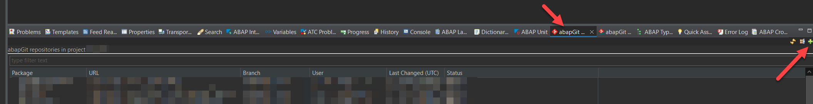
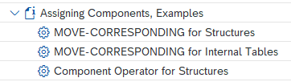

<br />
<div align="center">
  <a href="https://help.sap.com/doc/abapdocu_latest_index_htm/latest/en-US/index.htm?file=abenabap.htm">
    
  </a>
  <h3 align="center" style="font-size: 40px; color: #FCB913;">ABAP Cheat Sheets(미완)</h3>
<h5 align="center" style="font-size: 20px; color: #CCBFFF;">ABAP Cheat Sheets 한국어 버전(비공식)</h5>
  <p align="center">
    실행해볼 수 있는 예제와 함께 ABAP 문법을 간략하게 살펴봅시다.
    <br />
    <!--<a href=""><strong>Expore ABAP syntax in a nutshell & executable examples</strong></a>
    <br />-->
    <br />
    <a href="#%EF%B8%8F-활용-방법">활용 방법</a>
    ·
    <a href="#-abap-cheat-sheets-개요">Cheat Sheets</a>
    ·
    <a href="#-getting-started-with-the-examples">Examples</a>
  </p>
</div>
<br>
<hr>
<br>

[](https://api.reuse.software/info/github.com/SAP-samples/abap-cheat-sheets)

ABAP cheat sheets[^1] ...
<h3 style="color: #FFAAAA">(注) 원 레포지토리 READ_ME에서는 SAP에서 contribution 용도가 아니라고 밝히고 있습니다. 본 문서 한국어 번역은 비공식 번역임을 알려드립니다.
</h3>

본 문서는 의역이 포함되어 있으므로 정확한 내용은 [원문](https://github.com/malcano/abap-cheat-sheets)을 참고하여 주세요.

- **주제를 선택**하여 여러분이 참고할 수 있는 **ABAP** 레퍼런스를 확인할 수 있습니다.
- 본 문서는 **ABAP구문**을 중점으로 다룹니다.
- **코드 스니펫을 포함하고 있습니다.**
-  [SAP BTP ABAP 환경](https://help.sap.com/doc/abapdocu_cp_index_htm/CLOUD/en-US/index.htm?file=abensap_btp_abap_env_glosry.htm) (*main* branch; ABAP language version: [ABAP for Cloud Development](https://help.sap.com/doc/abapdocu_cp_index_htm/CLOUD/en-US/index.htm?file=abenabap_for_cloud_dev_glosry.htm))과 온프레미스 ABAP 시스템 ([classic ABAP](https://help.sap.com/doc/abapdocu_cp_index_htm/CLOUD/en-US/index.htm?file=abenclassic_abap_glosry.htm); the repository branches other than *main*)에서 [abapGit](https://abapgit.org/)을 사용하여 간단한 실행 가능한 데모 예제를 작동시키고, 확인해볼 수 있습니다. 
- 각 챕터의 링크를 통해 용어집과 **ABAP 키워드 문서** (*F1 도움말*)를 통해 더 자세한 내용을 확인할 수 있습니다.

<details>
<summary>💡 확인해주세요!</summary>
<br>

- ABAP 치트 시트는 개괄적인 정보를 제공할 뿐, 구문과 콘셉트에 대한 포괄적인 내용임을 보장하지는 않습니다. 더 많은 정보는 코드 내 키워드의 *F1* 또는 온라인 및 system-internal 버전에서 직접 검색하는 등의 방법으로 ABAP 키워드 문서를 참조해주시기 바랍니다.
- 본 치트 시트에서 별도로 명시되지 않는 한, 본 문서의 내용은 아래 ABAP 언어 버전을 기준으로 합니다.
(첫 항목 중심):
  - [ABAP for Cloud Development](https://help.sap.com/doc/abapdocu_latest_index_htm/latest/en-US/index.htm?file=abenabap_for_sap_cloud_glosry.htm): Restricted ABAP language scope for [ABAP Cloud](https://help.sap.com/doc/abapdocu_cp_index_htm/CLOUD/en-US/index.htm?file=abenabap_cloud_glosry.htm) → [Online version of the documentation](https://help.sap.com/doc/abapdocu_cp_index_htm/CLOUD/en-US/index.htm)
  - [Standard ABAP](https://help.sap.com/doc/abapdocu_latest_index_htm/latest/en-US/index.htm?file=abenstandard_abap_glosry.htm): Unrestricted ABAP language scope, for example, for [classic ABAP](https://help.sap.com/doc/abapdocu_cp_index_htm/CLOUD/en-US/index.htm?file=abenclassic_abap_glosry.htm) → [Online version of the documentation (latest version)](https://help.sap.com/doc/abapdocu_latest_index_htm/latest/en-US/index.htm?file=abenabap.htm)
- [알려진 이슈](#-알려진-이슈)와 [면책조항](#%EF%B8%8F-disclaimer)을 확인해주세요.
- 본 치트시트는 ABAP 키워드 문서의 항목과 토픽에 대한 링크를 제공합니다. 
기존의 ABAP-only 치트 시트와 달리, ABAP for Cloud Development의 링크를 참조합니다.
- [여기](https://help.sap.com/doc/abapdocu_cp_index_htm/CLOUD/en-US/index.htm?file=abenrestricted_abap_elements.htm)를 눌러 
ABAP 버전에 따른 ABAP 언어 요소의 차이를 확인할 수 있습니다. &nbsp;&nbsp; i. e. ABAP Cloud 허용 여부 등<br>
또한, [여기](https://help.sap.com/doc/abapdocu_cp_index_htm/CLOUD/en-US/index.htm?file=abenreleased_apis.htm)를 눌러 릴리즈된 API를 확인할 수 있습니다.
- 모든 ABAP 치트 시트를 한 레포지토리에 보관할 목적으로, 클래식 ABAP에만 해당하는 ABAP 치트 시트 문서도 ABAP Cloud 예제를 위한 *main* 브랜치에 포함됩니다.
- 클래식 ABAP용 브랜치에 포함된 예제 class는 대부분 ABAP for Cloud Development에서도 사용할 수 있습니다. 서브패키지 `TEST_ABAP_CHEAT_SHEETS_CLASSIC`는 스탠다드 ABAP과 관련된 구문을 포함하고 있으며, dynpro ABAP과 같은 키워드는 ABAP for Cloud Development에서 사용할 수 없습니다.

</details>

<br>

## 🏗️ 활용 방법

1. **ABAP 구문 정보**: [ABAP cheat sheets](#-abap-cheat-sheets-overview)에서 간단한 설명을 통해 다양한 ABAP 구문과 개념을 익혀보세요.
2. **예제**: [abapGit](https://abapgit.org/)을 사용하여 ABAP development object를 레포지토리로 가져오고([여기](#-getting-started-with-the-examples)를 참조) [ABAP development tools for Eclipse (ADT)](https://tools.eu1.hana.ondemand.com/)환경에서 *F9*를 눌러 데모 클래스를 실행시켜 ABAP구문이 작동되는 것을 확인할 수 있어요.
<br>

## 📝 ABAP Cheat Sheets 개요

| Cheat Sheet        | 내 용           |  Demo 예제  |
| ------------- | ------------- | ----- |
|[ABAP for Cloud Development](19_ABAP_for_Cloud_Development.md)| ABAP Cloud 용어 개괄 및 ABAP for Cloud Development 환경을 위한 클래식 ABAP | [zcl_demo_abap_cloud_excursion](./src/zcl_demo_abap_cloud_excursion.clas.abap) (cheat sheet 내용 참조) |
|[데이터 타입과 데이터 오브젝트 (Data Types and Data Objects)](16_Data_Types_and_Objects.md)| ABAP의 데이터 타입과 데이터 오브젝트에 대한 기본적인 설명 | [zcl_demo_abap_dtype_dobj](./src/zcl_demo_abap_dtype_dobj.clas.abap)   |
|[인터널 테이블 (Internal Tables)](01_Internal_Tables.md)| 인터널 테이블 생성, 삽입, 읽기, 정렬, 수정 | [zcl_demo_abap_internal_tables](./src/zcl_demo_abap_internal_tables.clas.abap)   |
|[스트럭쳐 (구조체) (Structures)](02_Structures.md)| 스트럭쳐 활용 기초 |  [zcl_demo_abap_structures](./src/zcl_demo_abap_structures.clas.abap)  |
|[ABAP SQL](03_ABAP_SQL.md)| `SELECT`를 사용하여 데이터베이스 테이블 읽기, `INSERT`, `UPDATE`,`MODIFY`,`DELETE`를 사용하여 데이터베이스 테이블의 데이터 수정하기 | [zcl_demo_abap_sql](./src/zcl_demo_abap_sql.clas.abap)   |
|[ABAP 오브젝트에 대해 알아보기 (ABAP Object Orientation) ](04_ABAP_Object_Orientation.md)|상속, 인터페이스 등 오브젝트와 컴포넌트 활용하기 | [zcl_demo_abap_objects](./src/zcl_demo_abap_objects.clas.abap) |
|[생성자 표현식(Constructor Expressions)](05_Constructor_Expressions.md)| `VALUE`, `CORRESPONDING`, `NEW`, `CONV`, `EXACT`, `REF`, `CAST`, `COND`, `SWITCH`, `FILTER`, `REDUCE` 등의 연산자를 활용한 생성자 표현식과 `FOR`, `LET`를 활용한 반복자 표현식 | [zcl_demo_abap_constructor_expr](./src/zcl_demo_abap_constructor_expr.clas.abap) |
|[동적 프로그래밍(Dynamic Programming)](06_Dynamic_Programming.md)| 동적 프로그래밍을 위한 요소로서의 필드 심볼과 데이터 레퍼런스, 동적 ABAP 구문 구성과 runtime type services (RTTS) i. e. runtime type identification (RTTI), runtime type creation (RTTC) |  [zcl_demo_abap_dynamic_prog](./src/zcl_demo_abap_dynamic_prog.clas.abap)  |
|[문자열 처리 (String Processing)](07_String_Processing.md)| 문자열 생성, 값 할당, 문자열 변경, 문자열 템플릿, 문자열 힙치기, 나누기, 수정, 탐색, 대치, 정규표현식 |  [zcl_demo_abap_string_proc](./src/zcl_demo_abap_string_proc.clas.abap)  |
|[ABAP for RAP: Entity Manipulation Language (ABAP EML)](08_EML_ABAP_for_RAP.md)| RAP 의 EML 환경설정, 표준(생성, 읽기, 갱신, 삭제), 비표준 작업 (actions) | <ul><li>[Demo RAP scenario with a managed RAP BO, external numbering (zcl_demo_abap_rap_ext_num_m)](./src/zcl_demo_abap_rap_ext_num_m.clas.abap)</li><br><li>[Demo RAP scenario with an unmanaged RAP BO, external numbering (zcl_demo_abap_rap_ext_num_u)](./src/zcl_demo_abap_rap_ext_num_u.clas.abap)</li><br><li>[Demo RAP scenario ("RAP calculator") with a managed, draft-enabled RAP BO,  late numbering (zcl_demo_abap_rap_draft_ln_m)](./src/zcl_demo_abap_rap_draft_ln_m.clas.abap) <br>해당 예제는 SAP Fiori UI 프리뷰 버전을 사용하여 확인할 수 있어요. 본 클래스 내 코멘트를 확인해주세요.</li><br><li>[Demonstrating the local consumption of RAP business events in the context of a RAP demo scenario, managed RAP BO with managed internal numbering and additional save (zcl_demo_abap_rap_m_as)](./src/zcl_demo_abap_rap_m_as.clas.abap)</li></ul>  |
|[Bit와 Byte에 대해 알아보기 (Excursion Down to Bits and Bytes)](09_Bits_and_Bytes.md)|데이터 타입과 데이터 오브젝트에 대한 기술적 배경|-|
|[ABAP SQL: 계층구조 활용하기 (Working with Hierarchies)](10_ABAP_SQL_Hierarchies.md)|DB 테이블에 저장되어 있는 계층적 데이터를 활용하기 위한 ABAP CDS와 함께 제공되는 ABAP SQL 기능|-|
|[인터널 테이블 그룹짓기 (Internal Tables: Grouping)](11_Internal_Tables_Grouping.md)|인터널 테이블 구문에서의 `GROUP BY` 조건 |[zcl_demo_abap_sql_group_by](./src/zcl_demo_abap_sql_group_by.clas.abap)|
|[ABAP Managed Database Procedures (AMDP)](12_AMDP.md)| AMDP(ABAP Managed Database Procedures)와 AMDP Functions (CDS Table Functions 포함)|[zcl_demo_abap_amdp](./src/zcl_demo_abap_amdp.clas.abap)|
|[프로그램 흐름 로직 (Program Flow Logic)](13_Program_Flow_Logic.md)|흐름 제어(`IF`, `CASE`)와 반복(`DO`, `WHILE`), 예외 처리|[zcl_demo_abap_prog_flow_logic](./src/zcl_demo_abap_prog_flow_logic.clas.abap)|
|[ABAP 단위 테스트](14_ABAP_Unit_Tests.md)|ABAP 내 단위 테스트에 대한 기본적인 설명|[zcl_demo_abap_unit_test](./src/zcl_demo_abap_unit_test.clas.abap)|
|[CDS 뷰 엔터티](15_CDS_View_Entities.md)|[여기](https://blogs.sap.com/2022/10/24/feature-matrix-data-modeling-with-abap-core-data-services/)에서 cheat sheet 콘텐츠를 확인할 수 있습니다. 본 문서에서는 CDS artifacts와 [실행가능한 예제 클래스](./src/zcl_demo_abap_cds_ve.clas.abap)에 중점을 두고 있습니다. (코멘트 포함)|[zcl_demo_abap_cds_ve](./src/zcl_demo_abap_cds_ve.clas.abap)|
|[SAP LUW](17_SAP_LUW.md)|SAP LUW 구문을 중점으로 관련된 데이터 정합성에 관한 [SAP LUW](https://help.sap.com/doc/abapdocu_latest_index_htm/latest/en-US/index.htm?file=abensap_luw_glosry.htm) 콘셉트 <br>💡실행 예제의 일부 구문은 [클래식 ABAP](https://help.sap.com/doc/abapdocu_cp_index_htm/CLOUD/en-US/index.htm?file=abenclassic_abap_glosry.htm)에만 해당하는 내용을 포함하고 있습니다.|프로그램 `ZDEMO_ABAP_SAP_LUW`|
|[Dynpro](18_Dynpro.md)|Dynpro를 중심으로 한 구문 개요 <br>💡[클래식 ABAP](https://help.sap.com/doc/abapdocu_cp_index_htm/CLOUD/en-US/index.htm?file=abenclassic_abap_glosry.htm)에만 해당하는 예제를 포함하고 있습니다.|프로그램 `ZDEMO_ABAP_DYNPRO`|
|[Selection Screen과 클래식 List (Selection Screens and Classic Lists)](20_Selection_Screens_Lists.md)|Selection-Screen과 class list에 대한 개요. SAP List Viewr (ALV)와 관련된 내용을 포함하고 있습니다. <br>💡[클래식 ABAP](https://help.sap.com/doc/abapdocu_cp_index_htm/CLOUD/en-US/index.htm?file=abenclassic_abap_glosry.htm)에만 해당하는 예제를 포함하고 있습니다.|프로그램 `ZDEMO_ABAP_SELSCR_LISTS_INTRO` ("intro" 프로그램: 다른 예제 프로그램을 실행할 수 있는 프로그램)|
|[ABAP에서 XML과 JSON 활용하기 (Working with XML and JSON in ABAP)](21_XML_JSON.md)| 클래스 라이브러리를 활용하여 XML처리와 XSLT와 Simple Transformations (ST)를 활용한 XML 변환, serialization(직렬화, ABAP -> XML ), deserealization(역직렬화, XML -> ABAP), JSON 데이터 활용|[zcl_demo_abap_xml_json](./src/zcl_demo_abap_xml_json.clas.abap) |
|[기타 ABAP 클래스(Misc ABAP Classes)](22_Misc_ABAP_Classes.md)|ABAP 클래스의 selection 소개, 기능들을 살펴볼 수 있는 코드 스니펫|-|

<br>

## 🎬 Getting Started with the Examples

ABAP Cheat Sheets는 ABAP Cloud에 중점을 두고 있습니다. 레포지토리 상 *main*브랜치의 예제는 SAP BTP ABAP 환경으로 가져올 수 있도록 설계되어 있습니다.
Classic ABAP의 경우, 레포지토리의 다른 브랜치에서 적절한 버전 (*v757* 는 ABAP 버전 7.57입니다)을 선택하여 샌드박스 SAP 시스템으로 예제를 가져올 수 있습니다. 
시스템 환경에 맞는 정보를 아래에서 확인하고 필요한 작업을 수행해주세요.
<details>
  <summary>1) General info</summary>
  <br>

- Some **DDIC artifacts**, such as database tables, are part of the repository. They are used by the examples to ensure self-contained examples. All artifacts must be imported for all examples to work.
- Most examples are designed to **display some output in the ADT console**. Once successfully imported, you can **run** the examples in ADT by choosing *F9* to display the output in the ADT console. The programs included in the branches for classic ABAP can be executed with *F8*.
- The examples **include descriptions and comments** in the code to provide explanations and set the context.
</details>

<details>
  <summary>2a) SAP BTP ABAP environment</summary>
  <br>

**Prerequisites**
- [x] You have access to an SAP BTP ABAP Environment instance (see [here](https://blogs.sap.com/2018/09/04/sap-cloud-platform-abap-environment) for additional information).
- [x] You have downloaded and installed the ABAP development tools for Eclipse (ADT). Make sure that you are using the latest version, as indicated on the [installation page](https://tools.hana.ondemand.com/#abap).
- [x] Before importing the code, you have performed a system-wide search for classes named `ZCL_DEMO_ABAP*`, for example, so that you do not run into errors when you try to import the code. If someone has already imported the content into the system, you can simply check out that imported version and proceed to the step *3) Run the code*.
- [x] You have created an ABAP cloud project in ADT that allows you to access your SAP BTP ABAP Environment instance (see [here](https://help.sap.com/viewer/5371047f1273405bb46725a417f95433/Cloud/en-US/99cc54393e4c4e77a5b7f05567d4d14c.html) for more information). Your login language is English.
- [x] You have installed the [abapGit](https://github.com/abapGit/eclipse.abapgit.org) plug-in for ADT from the [update site](http://eclipse.abapgit.org/updatesite/).


**Import Code**

Use the abapGit plug-in to install the <em>ABAP Cheat Sheets</em> by carrying out the following steps:

1. In your ABAP cloud project, create a package, for example, *ZABAP_CHEAT_SHEETS* as the target package. It is recommended that you assign the package to a transport request that is suitable for demo content.
2. Add the package to the *Favorite Packages* in the *Project Explorer* view in ADT.
3. To add the <em>abapGit Repositories</em> view to the <em>ABAP</em> perspective, choose *Window* → *Show View* → *Other...* from the menu bar and choose *abapGit Repositories*.
4. In the <em>abapGit Repositories</em> view, click the `+` icon in the upper right corner of the ADT tab to link a new abapGit repository.
  <br>

5. The *Link abapGit Repository* popup appears. Enter the following URL:

```
https://github.com/SAP-samples/abap-cheat-sheets.git
```

6. Choose *Next*.

7. On the *Branch and Package Selection* screen, enter the name of the created package (for example, *ZABAP_CHEAT_SHEETS*) in the *Package* field.
8. Choose *Next*.
9.  On the *Select Transport Request* screen, select the created transport request that is suitable for the demo content and choose *Finish* to link the Git repository to your ABAP cloud project. If the created package is already assigned to a transport request for the demo content, and a message appears that an object is already locked in a transport request, choose *Finish*, too.
10. In the *abapGit Repositories* view, filter for your package. The repository appears in the *abapGit Repositories* view with the status <em>Linked</em>.
11. Right-click on the new abapGit repository and choose *Pull...* to start the cloning of the repository contents.
12. On the *Branch and Package Selection* screen, choose *Next*.
13. If the *Locally Modified Object* screen is displayed, select the objects (for example, the package to automatically select all artifacts) from the list and choose *Next*.
14. On the next screen, select a transport request and choose *Finish*. Same as above, if an *object already locked* message is displayed, choose *Finish* as well. The status in the *abapGit Repositories* view changes to <em>Pull running...</em>. Note that the pull run may take several minutes.
15. Once the cloning is complete, the status changes to *Pulled Successfully*. You may need to refresh the *abapGit Repositories* view to see the progress of the import. To do this, choose the  *Refresh* icon in the upper right corner of the view.
16. Refresh your project tree. For example, in ADT, right-click the package and choose *Refresh*. The package should contain all the artifacts from the GitHub repository.
17. Make sure that all artifacts are active. To activate all inactive development objects, choose the *Activate all inactive ABAP development objects* button from the menu (or choose *CTRL+Shift+F3*).
</details>

<details>
  <summary>2b) Classic ABAP (on-premise ABAP systems)</summary>
<br>

**Prerequisites**
- [x] You are running an [ABAP release](https://help.sap.com/doc/abapdocu_latest_index_htm/latest/en-US/index.htm?file=abennews-75.htm) for which examples are available. See the different branches of the repository. For example, you can find out about your ABAP release by checking the value of `sy-saprl`:  
  ```abap
  DATA rel LIKE sy-saprl.
  rel = sy-saprl.
  BREAK-POINT.
  ```
- [x] Before importing the code, you have performed a system-wide search for classes named *ZCL_DEMO_ABAP**, for example, to avoid errors when you try to import the code. If someone has already imported the content into the system, you can simply check out that imported version and proceed to the step *3) Run the code*.
- [x] You have downloaded and installed the ABAP development tools for Eclipse (ADT). Make sure that you are using the latest version, as indicated on the [installation page](https://tools.hana.ondemand.com/#abap).
- [x] You have created an ABAP project in ADT that allows you to access your application server as mentioned above. Your login language is English.
- [x] You have downloaded and installed the standalone version of the abapGit report. Make sure you are using the latest version, as indicated on the [installation page](https://docs.abapgit.org/). You can create a report, for example, *zabapgit_standalone*, and copy and paste [this code](https://raw.githubusercontent.com/abapGit/build/main/zabapgit_standalone.prog.abap) into the program.

**Import Code**

Use the standalone version of the abapGit report to import the demo examples of the ABAP cheat sheets by performing the following steps:
1. In your ABAP project, create a package, such as *TEST_ABAP_CHEAT_SHEETS* as a target package suitable for demo content (for example, by using *LOCAL* as the software component).
2. Add the package to the *Favorite Packages* in the *Project Explorer* view in ADT.
3. Run the standalone version of the abapGit report.
4. Choose the *New Online* button. If the button is not available, for example, if another repository is already open, choose the *Repository List* button.
5. On the *New Online Repository* screen, make the following entries:
   - ***Git Repository URL***:

      ```
      https://github.com/SAP-samples/abap-cheat-sheets.git
      ```

   - ***Package***: Your demo package, for example, *TEST_ABAP_CHEAT_SHEETS*
   - ***Branch***: Choose the button with the 3 dots to the right of the input field. In the pop-up window, select the appropriate branch, e.g. *v757* if your ABAP release is 7.57, and choose the *Continue* (✔️) button. **Note**: The examples in the *main* branch are for ABAP Cloud only. 
   - ***Folder Logic***: *Full*
6. Choose *Create Online Repo*.
7. The *Repository* screen displays the available ABAP artifacts to be imported into your ABAP system.
8. Choose the *Pull* button. The import of the artifacts is triggered. This may take a while.
9. If the *Inactive Objects* popup is displayed, select all artifacts and choose *Continue* (✔️).
10.	When the cloning is complete, refresh your project tree. For example, in ADT, right-click on the package and choose *Refresh*. The package should contain all artifacts from the GitHub repository.
11. Make sure that all artifacts are active. To activate all inactive development objects, choose the *Activate all inactive ABAP development objects* button from the menu (or choose *CTRL+Shift+F3*).

</details>

<details>
  <summary>3) Run the code</summary>
<br>

- Open the package you created containing the imported ABAP artifacts in the ABAP development tools for Eclipse (ADT).
- Classes: 
  - Open one of the ABAP cheat sheet example classes listed in the [ABAP Cheat Sheets Overview](#-abap-cheat-sheets-overview) section, for example, *zcl_demo_abap_string_proc*. The classes are located in the *Source Code Library* → *Classes* folder.
  - Choose *F9* to run the class. Alternatively, choose *Run* → *Run As* → *2 ABAP Application (Console)* from the menu. 
  - Check the console output.
    > **💡 Note**<br>
    >- Check the notes on the context and the ABAP syntax used that are included as comments in the class.
    >- Due to the amount of output in the console, the examples include numbers (e.g. 1) ..., 2) ..., 3) ...) that represent the headers of each example code section. Also, in most cases, the variable name is displayed in the console. Therefore, to find the relevant output in the console more easily and quickly, simply search the console for the number (e.g. search for *3)* for the particular output) or variable name (*CTRL+F* in the console), or use breakpoints in the code to check variables in the debugger.
    >- You may want to clear the console by right-clicking in the console and choosing *Clear* before running another demo class to avoid confusing the output of multiple classes.
- Programs:
  - The programs included in the repository can be executed with *F8* (or *Run* → *Run As* → *1 ABAP Application*). 


</details>

<br>

## ⚡ 알려진 이슈
- 모든 오브젝트의 이름은 전역적(globally)으로 유일해야 하므로 시스템의 한 사용자만 본 레포지토리를 import할 수 있습니다. **ZCL_DEMO_ABAP** 클래스를 가져온다면, 해당 이름으로 된 클래스를 시스템 전체에서 찾아본 후 본 코드를 import 해주세요. 이미 시스템으로 가져온 클래스라면 앞서 import된 코드를 참조하세요.
- 코드 체크 시 다음과 같은 warning이 발생할 수 있습니다. , e.g. 코드 길이가 길어지는 것을 방지하기 위하여 `ORDER BY` 조건을 사용하지 않거나 `SELECT * `을 사용하였습니다.(for the many strings in the code, not using an `ORDER BY` clause, or messages regarding using `SELECT *`), ABAP 구문에 집중하기 위해 의도적으로 [pragmas](https://help.sap.com/doc/abapdocu_cp_index_htm/CLOUD/en-US/index.htm?file=abenpragma_glosry.htm)와 [pseudo comments](https://help.sap.com/doc/abapdocu_cp_index_htm/CLOUD/en-US/index.htm?file=abenpseudo_comment_glosry.htm)를 사용하지 않습니다. [면책조항](#%EF%B8%8F-disclaimer)도 함께 확인해주세요.
- 온 프레미스 ABAP 시스템으로 예제를 import 하는 경우, 다음과 같은 사안을 유의해주세요: 본 문서는 정보의 분산을 방지하고 용이한 관리를 위해 ABAP릴리즈를 고려하지 않고 ABAP 문법을 다룹니다. 따라서, 릴리즈 버전이 낮을수록 유효한 예제가 적습니다. 특히, RAP 예제는 ABAP 7.56 이상의 버전이 요구됩니다.
클래식 ABAP 브랜치의 예제의 경우, 특정 ABAP 릴리즈와 클래식 ABAP에 대한 문법 활용과 설정을 모두 반영하고 있지는 않습니다.
- XSLT/ST 오브젝트 import 문제가 발생하였다면, 세 `...source.xml`파일 ([zdemo_abap_st_carrhtml](./src/zdemo_abap_st_carrhtml.xslt.source.xml), [zdemo_abap_st_strhtml](./src/zdemo_abap_st_strhtml.xslt.source.xml), [zdemo_abap_xslt_fl](./src/zdemo_abap_xslt_fl.xslt.source.xml))의 코드를 직접 붙여넣고 모든 오브젝트를 활성화해보세요.
<br>

## ℹ️ More Information
- For the system-internal version of the ABAP Keyword Documentation in 
  - ... **classic ABAP**: Access the documentation in the SAP GUI via the transactions `ABAPDOCU` (opens the documentation directly) and `ABAPHELP` (opens an input field with which you can search the documentation content, for example, you can search for a keyword such as `SELECT`). Or, of course, choose `F1` on a keyword in your code. If you are in the SAP GUI (e.g. in `SE80`), the system-internal version opens. If you are in ADT, the documentation opens in the *ABAP Language Help* view.
  - ... **ABAP Cloud**: In ADT, the documentation is in the *ABAP Language Help* view, where you can also search. If you choose `F1` on a keyword in your code, the documentation opens there.
- Links to the online version of the ABAP Keyword Documentation for:
  - **Standard ABAP**: Unrestricted ABAP language scope for [classic ABAP](https://help.sap.com/doc/abapdocu_cp_index_htm/CLOUD/en-US/index.htm?file=abenclassic_abap_glosry.htm) → [Online version of the documentation (latest version)](https://help.sap.com/doc/abapdocu_latest_index_htm/latest/en-US/index.htm?file=abenabap.htm). To access the online documentation for a specific ABAP version, e.g. 7.54, you can select the version from the drop-down list [here](https://help.sap.com/docs/ABAP?locale=en-US) (*latest* is preselected). The *ABAP* link under *Development* will take you to the documentation of choice.
  - **ABAP for Cloud Development**: Restricted ABAP language scope for developments, for example, in the SAP BTP ABAP environment → [Online version of the documentation](https://help.sap.com/doc/abapdocu_cp_index_htm/CLOUD/en-US/index.htm)
- For demonstration examples of the ABAP Keyword Documentation in classic ABAP, see the `SABAPDEMOS` package.  This package contains all the examples used in the ABAP Keyword Documentation. For the context, class/program name, etc., see the [example page](https://help.sap.com/doc/abapdocu_latest_index_htm/latest/en-US/index.htm?file=abenabap_examples.htm), which is also available in the system-internal SAP GUI version as a node in the topic tree and which summarizes the executable examples. Of course, you can also find the example topics in the context of the individual topic of the ABAP keyword documentation. The example topics are marked with a ⚙️ icon:

  

<br>

## ⚠️ Disclaimer
The code examples presented in this repository are only syntax examples and are not intended for direct use in a production system environment. The code examples are primarily intended to provide a better explanation and visualization of the syntax and semantics of ABAP statements and not to solve concrete programming tasks. For production application programs, a dedicated solution should therefore always be worked out for each individual case.
There is no guarantee for either the correctness or the completeness of the code. In addition, there is no legal responsibility or liability for possible errors or their consequences, which occur through the use of the example code.

<br>

## 📟 Support
This is not intended to be a contribution repository, so please do not create pull requests. If you like to address issues or suggestions regarding additional syntax to be covered, please create an issue. However, this project is provided "as-is": there is no guarantee that raised issues will be answered or addressed in future releases.

<br>

## 📜 License
Copyright (c) 2022 SAP SE or an SAP affiliate company. All rights reserved. This project is licensed under the Apache Software License, version 2.0 except as noted otherwise in the [LICENSE](LICENSE) file.

[^1]: "A written [...] aid (such as a sheet of notes) that can be referred to for help in understanding or remembering something complex" (Definition for "cheat sheet" in Merriam-Webster Dictionary).